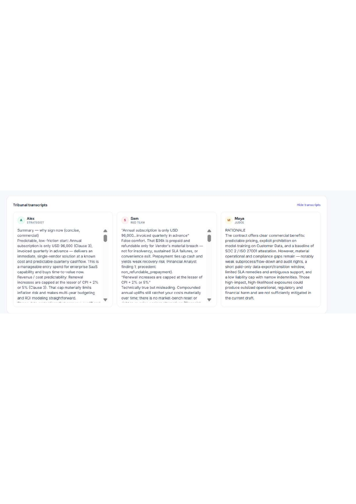

# The Aegis

**A multi-provider AI tribunal for contract risk analysis.**

Drop a PDF in. A Planner picks two-to-five domain specialists to analyse it, each specialist runs against a `search_precedent` tool over a built-in knowledge base of 34 contract risk patterns, a Strategist (Alex) argues the bullish case, a Red Team (Sam) tears it apart, a Judge (Maya) renders a structured ruling with a 0–100 risk score and a list of conditions to fix before signing. The whole deliberation streams live to the browser over one WebSocket. Same PDF the second time? It comes back from the SQLite cache with zero API calls and sub-100 ms wall-clock.

Bring your own key for **Gemini** *or* **OpenAI** — the same pipeline runs on `gemini-2.5-flash`, `gemini-2.5-pro`, `gpt-5`, `gpt-5-mini`, `gpt-4o`, or `gpt-4o-mini`. The model picker is grouped by provider and auto-switches when you paste a key with a different prefix.


The three agents are observable in real time. Alex argues the bullish case, Sam quotes Alex and dismantles each point, Maya reads both and rules:



Every ruling carries a full risk matrix with likelihood, impact, and a documented mitigation per row, plus a pre-signature conditions list when the verdict is CONDITIONAL-GO:


---

## Two pipeline modes

The Gemini free tier is capped at 20 requests per day on `gemini-2.5-flash`. The app ships with two pipelines and a mode picker so the same codebase fits a free-tier-friendly workflow *and* a paid-key workflow:

| Mode | API calls per run | Free-tier runs per day | Pipeline |
|---|---|---|---|
| **Fast** (default on Gemini) | 3 | ~6 | Alex → Sam → Maya, straight from the PDF |
| **Full multi-agent** (default on OpenAI) | 8 – 15 | 1 – 2 | Planner → Specialists with tool use → Alex → Sam → Maya → Critique → optional revise |

Both modes write to the same cache and emit the same verdict shape, so the dashboard works the same either way.

## The agents

| Agent | Role | What it does |
|---|---|---|
| **Planner** (Full only) | Picks specialists | Reads the document and chooses 2–5 specialists from `{financial, legal, data, compliance, operations}` |
| **Specialists** (Full only) | Domain analysis | Each one runs with access to the `search_precedent` tool against the built-in knowledge base. Each writes a markdown report. |
| **Alex** | Strategist | Synthesises the strongest bullish case from the specialist reports (or directly from the PDF in Fast mode) |
| **Sam** | Red Team | Reads Alex's case and tears it apart point by point. Also has access to `search_precedent`. |
| **Maya** | Judge | Reads everything and emits a fenced JSON ruling that matches a Pydantic schema |
| **Critique** (Full only) | Alex & Sam respond | If either dissents from Maya's ruling, Maya runs once more to revise |

## The ruling

Maya's output ends with a fenced JSON block that always validates against this schema:

- `verdict` — `GO`, `NO-GO`, or `CONDITIONAL-GO` (the UI renders `CONDITIONAL-GO` as **MAYBE**; the other two display verbatim)
- `risk_score` — integer 0 to 100, scored against an explicit additive rubric in Maya's prompt
- `headline` — one-line summary
- `risks` — at least four rows, each with `Low`/`Medium`/`High` likelihood and impact and a concrete mitigation
- `conditions` — list of fixes to apply (populated only for `CONDITIONAL-GO`)

Behind that is a four-stage recovery chain: primary parse → temperature-0 re-extraction with the same model → escalation to the provider's stronger model (`gemini-2.5-pro` for Google, `gpt-4o` for OpenAI) → heuristic floor that scans the text for verdict keywords. The app never crashes on the user even when the model misbehaves.

## Provider support

| Key prefix | Provider | Models routed to |
|---|---|---|
| `AIza...` | Google | `gemini-2.0-flash`, `gemini-2.0-flash-lite`, `gemini-2.5-flash`, `gemini-2.5-flash-lite`, `gemini-2.5-pro` |
| `sk-...` | OpenAI | `gpt-4o`, `gpt-4o-mini`, `gpt-5`, `gpt-5-mini` |
| `sk-ant-...` | Anthropic | Detected but explicitly rejected with a clear error message |

The provider is detected from the key prefix. The WebSocket cross-checks key against model and refuses with a clear error if they disagree ("the `gpt-5` model belongs to the openai provider, but the key you pasted is a google key"). The OpenAI dependency is optional — if `langchain-openai` is missing the app still boots for Gemini users and rejects OpenAI keys with an install hint.

Two model-specific quirks are handled inside the provider factory:

- The **gpt-5 family** rejects any non-default `temperature`. The factory pins `temperature=1` for `gpt-5` and `gpt-5-mini` because `ChatOpenAI`'s own default (`0.7`) is also rejected. Regression tests guard this.
- **Token counting** uses `tiktoken` for OpenAI models (the `o200k_base` encoder catches gpt-5-family models tiktoken does not yet register) and the `len(text) // 4` approximation only for Gemini. Cost figures for OpenAI rows are therefore actually accurate.

## The knowledge base

`knowledge_base.py` ships with 34 hand-curated contract risk patterns across 15 categories: liability, indemnification, termination, pricing, data, IP, disputes, SLA, assignment, confidentiality, governing law, warranty, exit, compliance, audit.

Retrieval is pure-Python TF-IDF with cosine similarity in about 60 lines of code. The corpus is tokenised and vectorised once at module load, so a `search_precedent("liability cap 3 months")` query is one dot-product against 34 sparse vectors. No vector store, no embedding service, no extra dependencies.

When a specialist calls the tool, the top-4 matches come back as a JSON list with title, pattern, risk, and mitigation. The model then quotes that language verbatim in its analysis, which is how the final risk-matrix mitigations end up grounded in documented precedent rather than invented from training memory.

## Measured performance

End-to-end runs on the two sample contracts. Both PDFs are over the 100,000-character extractor limit, so both ran through the map-reduce condensation path. Costs are list-price equivalents. The `gpt-4o-mini` row's four-decimal figure matches the verdict export committed at [`docs/sample_verdicts/contract_balanced__gpt-4o-mini.json`](docs/sample_verdicts/contract_balanced__gpt-4o-mini.json); the `gpt-5-mini` figures are read off the dashboard screenshots in [`docs/`](docs/).

| Document               | Model         | Time     | Tokens | Cost (list) | Verdict          | Risk |
|------------------------|---------------|----------|--------|-------------|------------------|------|
| `contract_balanced.pdf`| `gpt-5-mini`  | 298.03 s | 5,864  | $0.0034     | CONDITIONAL-GO   | 78   |
| `contract_balanced.pdf`| `gpt-4o-mini` | 100.54 s | 4,241  | $0.001422   | CONDITIONAL-GO   | 70   |
| `contract_mixed.pdf`   | `gpt-5-mini`  | 268.25 s | 5,227  | $0.0038     | CONDITIONAL-GO   | 85   |

All three runs land in the same verdict band (CONDITIONAL-GO). The score moves by 7 to 15 points across model and document — the agents agree on whether to sign with conditions but disagree on how nervous to be about it. On the balanced contract `gpt-4o-mini` reaches the same band as `gpt-5-mini` at **about 2.4× lower cost and 3× lower latency** — for the "quick scan to decide if I need to read this myself" use case, it's the default-default.

### Cache replay

A second click on the same PDF and the same model returns from the SQLite cache:

| Original run                                | Cache replay | API spend on replay | Compute saved |
|---------------------------------------------|--------------|---------------------|---------------|
| `gpt-5-mini` on `contract_balanced.pdf` (298.03 s, $0.0034)  | **< 100 ms** | **$0.00** | full 298.03 s |
| `gpt-5-mini` on `contract_mixed.pdf` (268.25 s, $0.0038)     | **< 100 ms** | **$0.00** | full 268.25 s |
| `gpt-4o-mini` on `contract_balanced.pdf` (100.54 s, $0.001422) | **< 100 ms** | **$0.00** | full 100.54 s |

Zero API calls on a hit. The wall-clock floor on a replay is the WebSocket round-trip; the SQLite lookup itself is sub-millisecond.

## Quick start

Requires **Python 3.10–3.14**. Python 3.14 needs `pydantic>=2.11` for pre-built wheels (the pinned requirements already use it — otherwise `pip` tries to compile `pydantic-core` from source via `maturin` and `cargo` and most Windows machines don't have a Rust toolchain).

```bash
git clone https://github.com/Abdullah-373/The-Aegis.git
cd The-Aegis
pip install -r requirements.txt
python main.py
```

The app opens `http://localhost:8000` in your default browser about a second after startup. If you're running headless (Docker / SSH / CI), set `AEGIS_NO_BROWSER=1` to skip the auto-open.

In the dashboard: paste your Gemini *or* OpenAI key, pick a model, pick a mode (Fast for cheap-and-quick, Full for the deep multi-agent pipeline), drop one of the sample contracts on the upload zone, and hit **Start analysis**.

### Past reports drawer

The side drawer lists every cached ruling with verdict, model, risk score, token count, and timestamp. Click a card to re-open the full transcripts and structured ruling without re-uploading the PDF. Click the trash icon to delete a cached run.

### Docker

```bash
docker build -t aegis .
docker run -p 8000:8000 aegis
```

The Dockerfile is multi-stage: a `node:22-alpine` stage pre-builds the Tailwind stylesheet, then the Python 3.12 runtime image copies it in. The runtime image is Node-free.

### Rebuilding the frontend stylesheet

The dashboard's CSS is pre-built into `templates/styles.css` (committed, 17 KB minified). If you edit `templates/index.html` or `tailwind.config.js`, regenerate it:

```bash
npm install
npm run build:css
```

The build scans the template for actual class usage and emits only those rules, plus a small safelist for the verdict colours built at runtime (the bug fix from the V2 days). The previous build pulled Tailwind from `cdn.tailwindcss.com`, which shipped the JIT compiler to the browser on every page load.

## Tech stack

- **Backend** — FastAPI (lifespan handlers), WebSockets, LangChain, LangGraph
- **LLMs** — Gemini 2.x via `langchain-google-genai`, OpenAI GPT-4o / GPT-5 via `langchain-openai`
- **Frontend** — vanilla JS, Tailwind CSS (pre-built, not CDN), Marked; three-view state machine + past-reports drawer
- **Storage** — SQLite (WAL mode), SQLAlchemy, idempotent column migrations
- **Validation** — Pydantic v2 (≥ 2.11 for Python 3.14 wheels) with a four-stage JSON recovery chain
- **Token counting / cost** — `tiktoken` for OpenAI (`o200k_base` for gpt-5 family), `len(text) // 4` fallback for Gemini, prices from a published-rates table
- **PDF** — `pypdf` with optional OCR fallback via Tesseract
- **Knowledge base** — pure-Python TF-IDF + cosine similarity over 34 in-code precedents
- **Tests** — `pytest`, 53 tests covering parsing, schema validation, retry classification, cost calculation, the API endpoints, knowledge-base retrieval, tool registration, graph topology, provider detection, the provider factory's gpt-5 temperature handling, the tiktoken counter, and the scoring rubric

## Architecture at a glance

```
Browser ───── WebSocket ─────→  FastAPI (lifespan)
                                  │
                            ┌─────┼─────┐
                          PDF     Cache   LLM (Gemini OR OpenAI)
                           │        │        │
                       pypdf/OCR  SQLite  detect_provider(key)
                                              │
                                  ┌───────────┴───────────┐
                                  │  Fast (3 calls)       │  Full (8-15 calls)
                                  │  Alex → Sam → Maya    │  Planner → Specialists
                                  └────────────────────┐  │     (with search_precedent
                                                       │  │      tool, RAG over 34-entry KB)
                                                       │  │     → Alex → Sam → Maya
                                                       │  │     → Critique → optional Revise
                                                       ↓  ↓
                                            Pydantic-validated structured ruling
                                            (4-stage recovery: primary parse →
                                             temp=0 retry → provider's strong model →
                                             heuristic floor)
```

## BYOK and privacy

The API key (Gemini or OpenAI) is supplied in the first WebSocket frame. It lives only in the LLM client's memory for the duration of the request. It is never written to disk, never logged, never stored in the cache. Cached verdicts contain transcripts and the structured ruling — never the key that produced them.

## Security model

The app is built for **single-user, local-network use**. The defaults reflect that. Before exposing it on a wider network:

- **Run behind TLS.** The API key is sent in the first WebSocket frame. Over plain `ws://` (not `wss://`) any intermediary on the network path can read it. Put nginx / Caddy / Cloudflare in front and terminate TLS there.
- **Add authentication to `/api/history` and `/api/verdict/{id}`.** They are unscoped — anyone who can reach the port can list every cached verdict and read the full transcripts. Add an `Authorization: Bearer …` header check or a session cookie before exposing these endpoints publicly.
- **Rate-limit the WebSocket handler.** Each Full-mode run costs 8–15 provider calls; a malicious client can drain your OpenAI credit quickly. Limit concurrent connections per IP at the reverse proxy or in middleware.
- **The SQLite cache is single-writer.** Fine for solo use, will bottleneck on concurrent uploads. Migrate to Postgres before any deployment that expects more than one user.
- **Cached verdicts contain the full contract text.** If your contracts are confidential, the SQLite file is a confidential artefact. Encrypt the volume at rest or set `aegis_cache.db` to be deleted on container shutdown.

## Project layout

```
├── main.py                    FastAPI app, lifespan, WebSocket pipeline, mode switch,
│                              retry/backoff, provider factory, tiktoken cost estimator,
│                              structured-output recovery, cache write, auto-open browser
├── agents.py                  LangGraph state machine, nodes, tool-execution loop,
│                              Maya's scoring rubric
├── knowledge_base.py          34 contract risk patterns + TF-IDF retrieval
├── tools.py                   @tool wrappers (search_precedent)
├── database.py                SQLAlchemy models, WAL-mode pragmas, idempotent migrations
├── templates/
│   ├── index.html             Single-page client (setup / live / verdict / past-reports)
│   ├── styles.src.css         Tailwind entry source
│   └── styles.css             Pre-built minified Tailwind output (committed)
├── tests/
│   └── test_main.py           53 unit + integration tests
├── samples/
│   ├── sample_contract.pdf    Adversarial test contract (V1/V2 original)
│   ├── contract_balanced.pdf  Well-drafted SaaS Master Licence
│   └── contract_mixed.pdf     Marketing analytics agreement with mixed risk profile
├── docs/
│   ├── REPORT.md                       Full technical report (markdown source)
│   ├── The_Aegis_Final_Report_v3.pdf   Rendered report PDF
│   ├── sample_verdicts/                Real cached verdict-export JSONs
│   └── fig_*.png                       Dashboard screenshots used in the report
├── package.json               Tailwind build script
├── tailwind.config.js         Tailwind config (with runtime-class safelist)
├── requirements.txt
├── Dockerfile                 Multi-stage: node CSS build + python runtime
├── LICENSE
└── README.md
```

## Limitations

A short, honest list of what this project does not do.

- **No authentication.** `/api/history` and `/api/verdict/{id}` are unscoped. On a shared deployment anyone with the URL can read every cached verdict. See the Security model section for the required mitigations.
- **No TLS by default.** The API key is sent in the first WebSocket frame. Over plain `ws://` it is visible to any intermediary on the network path.
- **No rate limiting.** A malicious client can drain an OpenAI account by opening many parallel WebSockets.
- **OCR requires external binaries.** Pure-text PDFs work out of the box. Scanned PDFs need `pytesseract`, `pdf2image`, and the `tesseract` and `poppler` binaries installed on the host.
- **The scoring rubric in Maya's prompt is advisory, not enforced.** It tightens the score distribution but the model can still emit risk 85 with verdict CONDITIONAL-GO (rubric says NO-GO at ≥75). A real fix would be Python-side post-validation that downgrades the verdict when the score crosses the threshold.
- **Per-token cost is computed from a hard-coded price table.** Will drift silently if Google or OpenAI change their published rates.
- **Agents pass state through the LangGraph reducer, not to each other.** A Specialist cannot ask another Specialist a follow-up question. The "tribunal" framing is louder than the actual inter-agent communication.
- **Anthropic keys are detected but rejected.** Wiring Claude in is one prefix and one factory branch — I did not have a Claude key during development.
- **SQLite single-writer.** Fine for one user, will bottleneck the moment two people upload PDFs at the same time. The SQLAlchemy abstraction makes this a one-line change to Postgres.

## License

MIT — see [`LICENSE`](LICENSE).

## Author

**Abdullah Hasan** · Student ID 807271


