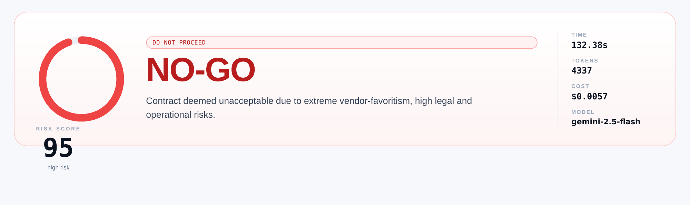
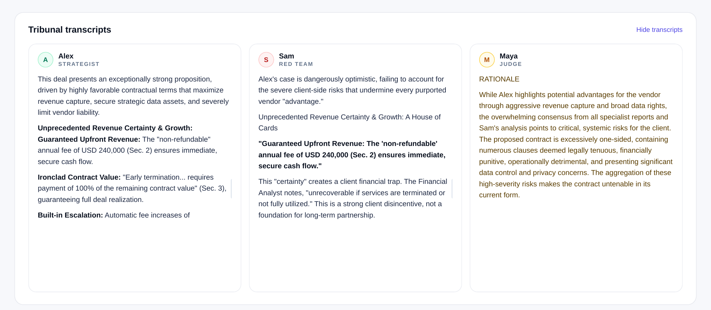
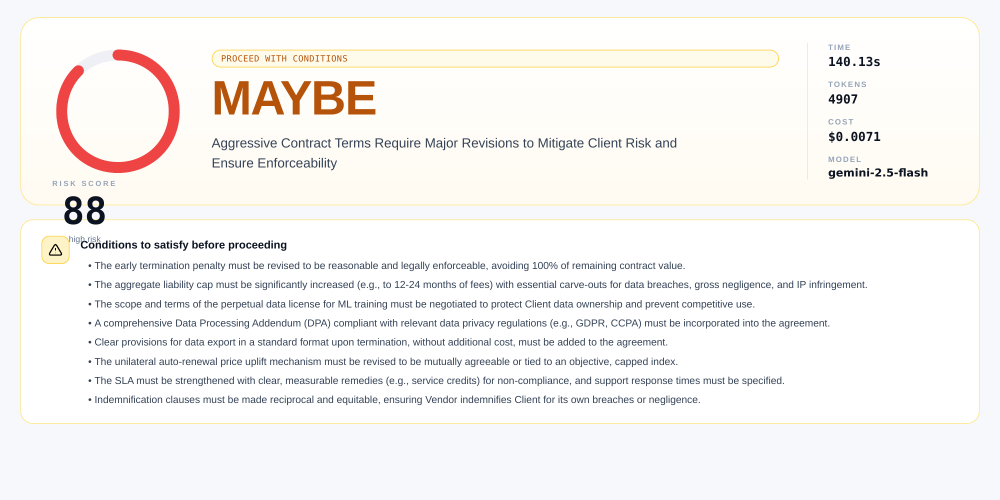

# The Aegis

**A multi-agent AI system for contract risk analysis.**

Upload a PDF. A planner agent picks which specialist analysts to run, the specialists do their analysis with access to a precedent search tool, a Strategist agent argues the bullish case, a Red Team agent attacks it, and a Judge agent renders a structured verdict with a 0–100 risk score and a list of conditions to fix. The whole deliberation streams live to the browser. Same PDF the second time? It comes back from the SQLite cache at zero API cost and in under two seconds.

Bring your own key for **Gemini** *or* **OpenAI** — the same pipeline runs on `gemini-2.5-flash`, `gemini-2.5-pro`, `gpt-5`, `gpt-5-mini`, `gpt-4o`, or `gpt-4o-mini`. Pick the model in the setup view; the app routes to the right provider automatically.



The three agents are observable in real time. Alex argues the bullish case, Sam quotes Alex and dismantles each point, Maya reads both and rules:



The pipeline is not strictly deterministic, so running the same PDF a second time can produce a softer verdict that surfaces the same risks but recommends fixing them rather than walking away:



---

## Two pipeline modes

The Gemini free tier is capped at 20 requests per day on `gemini-2.5-flash`, so the app ships with two pipelines and a mode picker:

| Mode | API calls per run | Free-tier runs per day | Pipeline |
|---|---|---|---|
| **Fast** (default) | 3 | ~6 | Alex → Sam → Maya |
| **Full multi-agent** | 8 – 15 | 1 – 2 | Planner → Specialists with tool use → Alex → Sam → Maya → Critique → optional revise |

Both modes write to the same cache and produce the same verdict shape, so the dashboard works the same either way. On a paid OpenAI key Full mode is effectively unmetered.

## The agents

| Agent | Role | What it does |
|---|---|---|
| **Planner** (Full only) | Picks specialists | Reads the document and chooses 2–5 specialists from `{financial, legal, data, compliance, operations}` |
| **Specialists** (Full only) | Domain analysis | Each one runs with access to the `search_precedent` tool against the built-in knowledge base. Each writes a markdown report. |
| **Alex** | Strategist | Synthesises the strongest bullish case from the specialist reports (or directly from the PDF in Fast mode) |
| **Sam** | Red Team | Reads Alex's case and tears it apart point by point. Also has access to `search_precedent`. |
| **Maya** | Judge | Reads everything and emits a fenced JSON ruling that matches a Pydantic schema |
| **Critique** (Full only) | Alex & Sam respond | If either dissents from Maya's ruling, Maya runs once more to revise |

## The ruling

Maya's output ends with a fenced JSON block that always validates against this schema:

- `verdict` — `GO`, `NO-GO`, or `CONDITIONAL-GO` (rendered to users as **PROCEED**, **WALK AWAY**, **MAYBE**)
- `risk_score` — integer 0 to 100
- `headline` — one-line summary
- `risks` — at least four rows, each with `Low`/`Medium`/`High` likelihood and impact and a mitigation
- `conditions` — list of fixes to apply (populated only for `CONDITIONAL-GO`)

There's a four-stage recovery chain: primary parse → temperature-0 re-extraction with the same model → escalation to the provider's stronger model (`gemini-2.5-pro` for Google, `gpt-4o` for OpenAI) → heuristic floor that scans the text for verdict keywords. The app never crashes on the user, even when the model misbehaves.

## Provider support

| Key prefix | Provider | Models routed to |
|---|---|---|
| `AIza...` | Google | `gemini-2.0-flash`, `gemini-2.0-flash-lite`, `gemini-2.5-flash`, `gemini-2.5-flash-lite`, `gemini-2.5-pro` |
| `sk-...` | OpenAI | `gpt-4o`, `gpt-4o-mini`, `gpt-5`, `gpt-5-mini` |
| `sk-ant-...` | Anthropic | Detected but explicitly rejected with a clear message |

The provider is detected from the key prefix; the WebSocket cross-checks key against model and refuses with a clear error if they disagree ("the `gpt-5` model belongs to the openai provider, but the key you pasted is a google key"). The OpenAI dependency is optional — if `langchain-openai` is missing the app still boots for Gemini users and rejects OpenAI keys with an install hint.

## The knowledge base

`knowledge_base.py` ships with 34 hand-curated contract risk patterns across 15 categories: liability, indemnification, termination, pricing, data, IP, disputes, SLA, assignment, confidentiality, governing law, warranty, exit, compliance, audit.

Retrieval is pure-Python TF-IDF with cosine similarity. The corpus is tokenised and vectorised once at module load, so a `search_precedent("liability cap 3 months")` query is one dot-product against 34 sparse vectors. No vector store, no embedding service, no extra deps.

When a specialist calls the tool, the top-4 matches come back as a JSON list with title, pattern, risk, and mitigation. The model then quotes that language in its analysis, which is how the final risk-matrix mitigations end up grounded in documented precedent rather than invented from training memory.

## Measured performance

End-to-end runs against the live OpenAI and Gemini APIs across the three sample contracts in **Full multi-agent mode**. Each row is a cold run (no cache hit). Costs are list-price equivalents at the providers' published per-million-token rates.

| Document               | Model              | Time     | Tokens | Cost (list) | Verdict          | Risk |
|------------------------|--------------------|----------|--------|-------------|------------------|------|
| `contract_balanced.pdf`  | `gpt-5`              | 617.03 s | 6,704  | $0.0941     | CONDITIONAL-GO   | 61   |
| `contract_mixed.pdf`     | `gpt-5`              | 549.98 s | 6,623  | ~$0.0820 *  | CONDITIONAL-GO   | 82   |
| `contract_mixed.pdf`     | `gpt-5-mini`         | 253.80 s | 6,072  | $0.0043     | CONDITIONAL-GO   | 78   |
| `contract_balanced.pdf`  | `gpt-4o-mini`        | 100.54 s | 4,241  | $0.0014     | CONDITIONAL-GO   | 70   |
| `sample_contract.pdf`    | `gemini-2.5-flash`   | 132.38 s | 4,337  | $0.0057     | NO-GO            | 95   |

\* Estimated from list-price; every other row uses the live dollar figure from the cached verdict export. Two of those exports are committed under [`docs/sample_verdicts/`](docs/sample_verdicts/) for reference.

The verdict category is robust across model families (every OpenAI run on `contract_balanced.pdf`/`contract_mixed.pdf` came back CONDITIONAL-GO; the Gemini run on the more adversarial `sample_contract.pdf` came back NO-GO). The mini-tier OpenAI models hit verdicts in the same band as gpt-5 at **roughly 67× lower cost** — a sensible default for quick scans.

### Cache replay

A second click on the same PDF + model returns from the SQLite cache:

| Original run                                | Cache replay | Saved      |
|---------------------------------------------|--------------|------------|
| 617.03 s / $0.0941 (`gpt-5`, balanced)      | **1.68 s**   | full spend |
| 30.65 s / $0.0051 (`gemini-2.5-flash`)      | **1.68 s**   | full spend |

Zero API calls on a hit. The wall-clock floor on a replay is set by the WebSocket roundtrip and the artificial token-streaming drip in `_replay_cached`, not by SQLite (the lookup itself is sub-millisecond).

## Quick start

Requires **Python 3.10–3.14**. (3.14 needs `pydantic>=2.11` — the pinned requirements already use it.)

```bash
git clone https://github.com/Abdullah-373/The-Aegis.git
cd The-Aegis
pip install -r requirements.txt
python main.py
```

The app opens `http://localhost:8000` in your default browser ~1 second after startup. If you're running headless (Docker / SSH / CI), set `AEGIS_NO_BROWSER=1` to skip the auto-open.

In the dashboard: paste your Gemini *or* OpenAI key, pick a model, pick a mode (Fast for cheap/quick, Full for the deep multi-agent pipeline), drop one of the sample contracts on the upload zone, and hit **Start analysis**.

### Past reports drawer

The side drawer lists every cached ruling with verdict, model, risk score, token count, and timestamp. Click a card to re-open the full transcripts and structured ruling without re-uploading the PDF. Click the trash icon to delete a cached run.

### Docker

```bash
docker build -t aegis .
docker run -p 8000:8000 aegis
```

The Dockerfile is multi-stage: a Node stage pre-builds the Tailwind stylesheet, then the Python runtime image copies it in. The runtime image is Node-free.

### Rebuilding the frontend stylesheet

The dashboard's CSS is pre-built into `templates/styles.css` (committed). If you edit `templates/index.html` or `tailwind.config.js`, regenerate it:

```bash
npm install
npm run build:css
```

The output is ~17 KB minified and contains only the classes the template actually uses (plus a small safelist for verdict colours built at runtime). The previous build pulled Tailwind from `cdn.tailwindcss.com`, which shipped the JIT compiler to the browser on every page load.

## Tech stack

- **Backend** — FastAPI (lifespan handlers), WebSockets, LangChain, LangGraph
- **LLMs** — Gemini 2.x via `langchain-google-genai`, OpenAI GPT-4o/GPT-5 via `langchain-openai`
- **Frontend** — vanilla JS, Tailwind CSS, Marked; three-view state machine + past-reports drawer
- **Storage** — SQLite (WAL mode), SQLAlchemy
- **Validation** — Pydantic v2 (≥ 2.11 for Python 3.14 wheels) with a four-stage JSON recovery chain
- **PDF** — pypdf with optional OCR fallback via Tesseract
- **Knowledge base** — pure-Python TF-IDF + cosine similarity over 34 in-code precedents
- **Tests** — pytest, 33 unit tests covering parsing, schema validation, retry classification, cost calculation, the API endpoints, knowledge-base retrieval, tool registration, and graph topology

## Architecture at a glance

```
Browser ───── WebSocket ─────→  FastAPI (lifespan)
                                  │
                            ┌─────┼─────┐
                          PDF     Cache   LLM (Gemini OR OpenAI)
                           │        │        │
                       pypdf/OCR  SQLite  detect_provider(key)
                                              │
                                  ┌───────────┴───────────┐
                                  │  Fast (3 calls)       │  Full (8-15 calls)
                                  │  Alex → Sam → Maya    │  Planner → Specialists
                                  └────────────────────┐  │     (with search_precedent
                                                       │  │      tool, RAG over 34-entry KB)
                                                       │  │     → Alex → Sam → Maya
                                                       │  │     → Critique → optional Revise
                                                       ↓  ↓
                                            Pydantic-validated structured ruling
                                            (4-stage recovery: primary parse →
                                             temp=0 retry → provider's strong model →
                                             heuristic floor)
```

## BYOK and privacy

The API key (Gemini or OpenAI) is supplied in the first WebSocket frame. It lives only in the LLM client's memory for the duration of the request. It is never written to disk, never logged, never stored in the cache. Cached verdicts contain transcripts and the structured ruling — never the key that produced them.

## Security model

The app is built for **single-user, local-network use**. The defaults reflect that. Before exposing it on a wider network:

- **Run behind TLS.** The API key is sent in the first WebSocket frame. Over plain `ws://` (not `wss://`) any intermediary on the network path can read it. Put nginx / Caddy / Cloudflare in front and terminate TLS there.
- **Add authentication to `/api/history` and `/api/verdict/{id}`.** They are unscoped — anyone who can reach the port can list every cached verdict and read the full transcripts. Add an `Authorization: Bearer …` header check or a session cookie before exposing these endpoints publicly.
- **Rate-limit the WebSocket handler.** Each Full-mode run costs 8–15 provider calls; a malicious client can drain your OpenAI credit quickly. Limit concurrent connections per IP at the reverse proxy or in middleware.
- **The SQLite cache is single-writer.** Fine for solo use, will bottleneck on concurrent uploads. Migrate to Postgres before any deployment that expects more than one user.
- **Cached verdicts contain the full contract text.** If your contracts are confidential, the SQLite file is a confidential artefact. Encrypt the volume at rest or set `aegis_cache.db` to be deleted on container shutdown.

## Project layout

```
├── main.py                    FastAPI app, lifespan, WebSocket pipeline, mode switch, retry,
│                              provider abstraction, auto-open browser
├── agents.py                  LangGraph state machine, nodes, tool-execution loop
├── knowledge_base.py          34 contract risk patterns + TF-IDF retrieval
├── tools.py                   @tool wrappers (search_precedent)
├── database.py                SQLAlchemy models, WAL-mode pragmas
├── templates/
│   └── index.html             Single-page client (setup / live / verdict / past-reports drawer)
├── tests/
│   └── test_main.py           33 unit tests
├── samples/
│   ├── sample_contract.pdf    Adversarial test contract (the one used in the original report)
│   ├── contract_balanced.pdf  Balanced contract for cross-model benchmarking
│   └── contract_mixed.pdf     Mixed-risk contract for cross-model benchmarking
├── docs/
│   ├── REPORT.md              Full technical report (markdown source)
│   ├── The_Aegis_Final_Report_v3.pdf   Rendered report PDF
│   └── *.png                  Dashboard screenshots
├── requirements.txt
├── Dockerfile
├── LICENSE
└── README.md
```

## Limitations

- `/api/history` and `/api/verdict/{id}` are unscoped — fine for solo use, needs auth before public deployment
- SQLite supports many readers but only one writer at a time (WAL mode helps but does not eliminate the bottleneck)
- OCR requires the `tesseract` and `poppler` binaries to be installed externally
- Per-token cost is computed from a hard-coded price table; will drift if Google or OpenAI changes prices
- Agents pass state through the LangGraph reducer rather than calling each other directly — no live inter-agent dialogue
- Anthropic keys are detected but explicitly rejected (wiring Claude into the provider abstraction is the obvious next addition)

## License

MIT — see [`LICENSE`](LICENSE).

## Author

**Abdullah Hasan** · Student ID 807271

University final project. The full technical report (architecture, development challenges, empirical assessment) is in [`docs/REPORT.md`](docs/REPORT.md) (markdown) and [`docs/The_Aegis_Final_Report_v3.pdf`](docs/The_Aegis_Final_Report_v3.pdf) (rendered).
