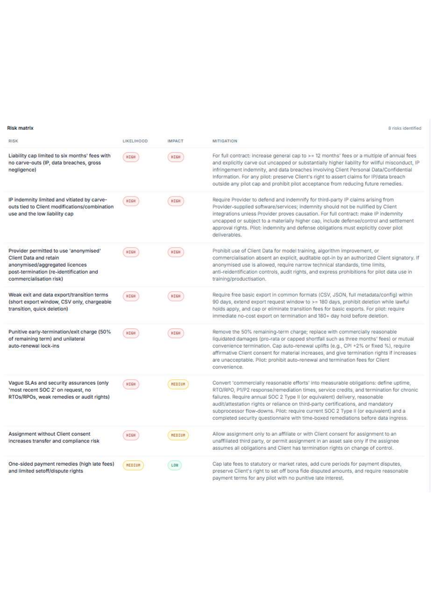
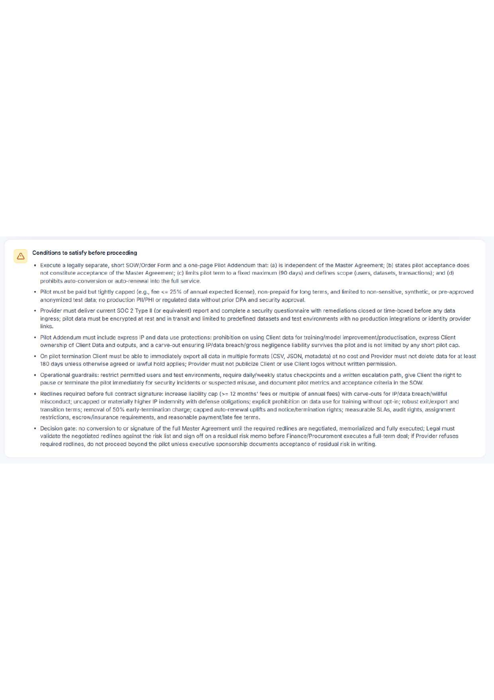
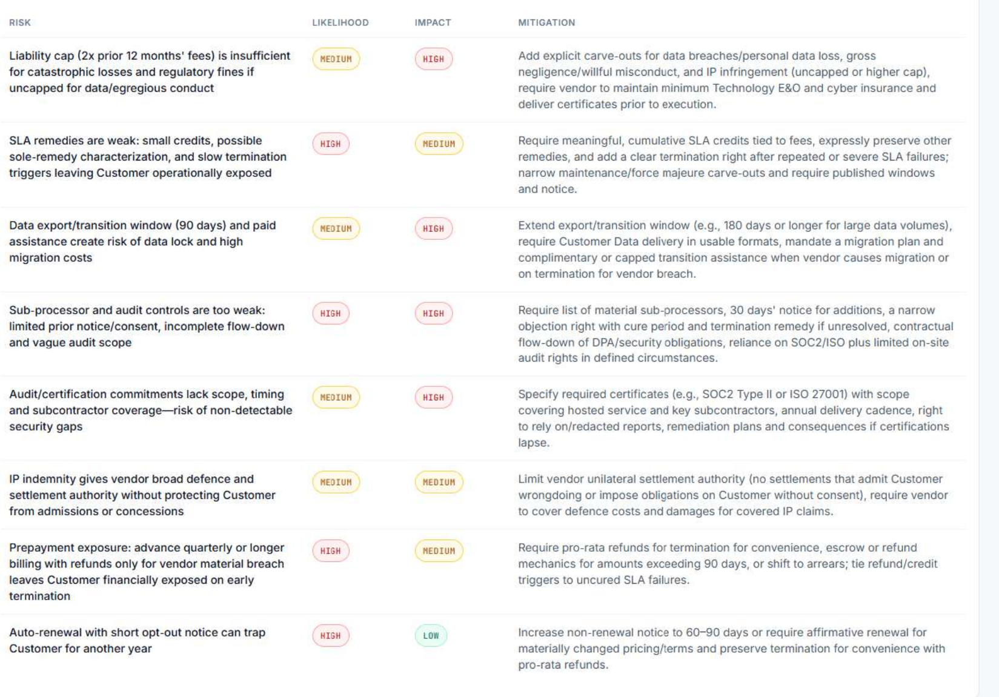

Source code: [github.com/Abdullah-373/The-Aegis](https://github.com/Abdullah-373/The-Aegis)

---

## Abstract

The Aegis reads contracts. You drop a PDF in, three agents argue about it, and you get a one-word verdict — GO, NO-GO, or CONDITIONAL-GO — together with a 0–100 risk score and the redlines you would need before signing.

The same repository holds three versions of the app, because each one taught me what the next had to fix. V1 ran three prompts in sequence: Alex argues to sign, Sam argues against, Maya rules. It worked, and it was honest enough to call itself three prompts in a line, not a multi-agent system. V2 replaced the middle of the pipeline with a LangGraph state machine: a Planner picks two-to-five specialists from {Financial, Legal, Data, Compliance, Operations}, each one gets a `search_precedent` tool over 34 hand-written risk patterns, and a critique step lets Alex and Sam push back on Maya. If either dissents, Maya rules again. V3 added OpenAI alongside Gemini so the same pipeline runs on either an `AIza...` or an `sk-...` key, dropped the Tailwind CDN for a real build, swapped `len(text) // 4` for `tiktoken`-based cost counting, and added a scoring rubric so the same contract does not drift across two verdict bands when the model changes.

Both pipelines sit behind a mode toggle. Fast retains the V1 design for free-tier runs (three calls per analysis). Full runs the LangGraph pipeline (8–15 calls) and is the default on a paid OpenAI key. Either mode writes to the same SQLite cache keyed on `SHA-256(extracted_text + model_name)`, so a second click on the same PDF returns the verdict with zero API calls.

Measurements from the two sample contracts in the repository (both over the 100,000-character extractor limit, so both ran the map-reduce condense path):

- `gpt-5-mini` on `contract_balanced.pdf` — CONDITIONAL-GO, **risk 78**, **5,864 tokens**, **\$0.0034**, 298.03 s original / sub-100 ms replay.
- `gpt-5-mini` on `contract_mixed.pdf` — CONDITIONAL-GO, **risk 85**, **5,227 tokens**, **\$0.0038**, 268.25 s original.
- `gpt-4o-mini` on `contract_balanced.pdf` — CONDITIONAL-GO, **risk 70**, 4,241 tokens, **\$0.001422**, 100.54 s. Same verdict band as `gpt-5-mini` at about 2.4× lower cost and 3× lower latency.
- Cache replay on any of these: **\$0.00**, zero outbound calls, under 100 ms.

The `gpt-4o-mini` figures match the JSON export under `docs/sample_verdicts/`. The `gpt-5-mini` figures are read off the dashboard screenshots in `docs/`. A reviewer who wants to double-check the four-decimal numbers can `cat` the JSON.

---

## 1. The Problem

Contracts are long. Nobody reads them. Either you skim and miss the dangerous clauses, or you pay a lawyer hundreds of dollars per page. Neither option scales to the mid-sized deals where legal fees consume a meaningful fraction of the contract value.

The obvious approach is to send the PDF to an LLM and ask for a summary. This fails for two reasons. A single model producing a single summary lands in the middle: it averages the upside and downside into a bland reading that offers no real basis for the decision to sign or decline. What a reviewer needs is the *spread*: the strongest reading of the deal *and* the worst reading, both at full strength, plus a third opinion. The second problem is downstream. If the output is free-form text, downstream code has to parse prose with regular expressions to extract a yes/no, and that parsing breaks the first time the model phrases its answer differently.

The Aegis addresses both problems at once. It never produces a neutral summary. Alex's bullish case and Sam's attack arrive as two separate transcripts, then Maya emits a verdict as a JSON object that conforms to a fixed Pydantic schema. The JSON feeds downstream code; the transcripts go to the reviewer. A third problem surfaced midway through the build: if you already pay for an OpenAI key, you should not need a Gemini key to use the app. V3 fixed this. Paste any supported key and the correct provider is selected automatically; the model picker switches with it.

---

## 2. Related Work

The Aegis sits where three lines of research meet: multi-agent LLM systems, retrieval-augmented generation, and LLM-based contract review. None of them is new on its own. The work is in how they combine, and in what each one had to give up to fit a working app a single developer could build in a term.

**Multi-agent LLM systems.** The idea that a single large language model is more useful as a committee of role-specialised personas than as one prompt has been explored under several names — debate, adversarial agents, role-specialised chat — and has spawned a small family of general-purpose multi-agent frameworks that wire shared message buses, role configurations, and turn-taking on top of an LLM. The Aegis takes a narrower path. Three fixed roles — Strategist, Red Team, Judge — communicate only through a typed state object (`TribunalState`), not through free-form chat. A critique step lets the Strategist and Red Team accept or dissent from the Judge, but they cannot interrupt each other mid-turn. A general-purpose framework would call this a `GroupChat` of size three with a fixed turn order. I chose the narrower shape because every transcript stays auditable, which matters when a reviewer has to justify their reading to a manager who has not read the contract either.

**Retrieval-augmented generation and tool use.** The `search_precedent` tool follows the now-standard pattern of interleaving model "thoughts" with tool calls until the model has enough grounding to answer. The retrieval side is retrieval-augmented generation in its simplest possible form: a sparse TF-IDF retriever over 34 hand-curated `Precedent` entries, no embeddings, no vector store, no external service. The trade-off against a dense embedding retriever is honest. A domain-fine-tuned transformer would give richer domain representations but would cost a fine-tune, a GPU budget, and a labelled legal corpus none of which I had. Pushing the domain knowledge into the retriever's corpus and letting a general-purpose LLM read it at inference time was the smaller bet, and it kept the knowledge base human-readable: a non-technical reviewer can open `knowledge_base.py` and audit every entry the model can ever cite.

**LLM-based contract review.** Commercial tools in this space — Spellbook, Harvey AI, Lexion — pair domain-specific retrieval layers with general-purpose models behind paid APIs. None of them publishes its architecture in enough detail for academic comparison, so I treat their existence as evidence that the architectural family is the right shape, not as baselines I can numerically beat. The closer published direction is framing contract review as natural-language inference over labelled clauses; the Aegis answers a different question — "should I sign this?" rather than "does clause X entail proposition Y?" — but borrows the same intuition that contract analysis is well-served by structured output rather than free prose.

**LLM-as-judge.** Maya's role is a single-model instance of the broader "LLM-as-judge" pattern, where a model is asked to grade or arbitrate over outputs rather than produce them directly. Here a single model consolidates two adversarial readings of the same input. The shared assumption is that an LLM, given a structured prompt and explicit evaluation criteria, can be a usable arbiter when the question is well-framed. The shared limitation, visible in §6.4 of this report, is that the arbiter can be biased by its own training, by the order in which it sees the arguments, and by the language the arguments are phrased in.

**Where this work is genuinely new.** Not in any individual component. The structured-output recovery chain in §4.4 — regex, temperature-zero re-extract, same-provider stronger-model escalation, heuristic floor — is the part I have not seen written down in the prior work above, and is the difference between an LLM contract-review demo that crashes once a week and one that always returns *something*. The content-hash cache keyed on `SHA-256(extracted_text + model_name)` (§4.6) is similarly obvious in hindsight and almost completely absent from the literature, which still treats LLM calls as stateless. Neither is a theoretical contribution. Both are the kind of engineering that turns "works on my machine" into "I would let a non-technical user run this on a real contract."

---

## 3. Design Choices

The reasoning behind each component, not a survey of every library. Where a decision later caused trouble, I point to the relevant story in §5.

**Three agents, not one summary.** A single summary hides the gap between the optimistic and pessimistic read. That gap is the whole point of a contract review. I picked a fixed three-role pipeline — Alex (Strategist), Sam (Red Team), Maya (Judge) — instead of free-form multi-agent chat. Roles are hard-coded in `HELPERS` (`main.py:216`). The transcripts stay auditable, which matters when a reviewer has to justify their reading to a manager who didn't read the contract either.

**LangGraph for the V2 pipeline.** Once V2 had a Planner, five conditional specialists, two parallel critique nodes, and an optional revision pass, the control flow in `main.py` got ugly fast. I moved the topology into a `StateGraph` with a typed `TribunalState` (`agents.py:114`) and explicit nodes. The "if either critic dissents, send the ruling back to Maya" branch is a conditional edge now. The graph is one diagram instead of three pages of `if/elif`.

**One tool, not a tool framework.** Specialists and the Red Team have access to exactly one thing: `search_precedent(query)` in `tools.py:13–42`. It runs TF-IDF over 34 hand-written `Precedent` entries in `knowledge_base.py` and returns the top four. No external embedding service, no vector DB, no extra deps. The corpus is small enough that a dot-product against 34 sparse vectors beats anything you'd call across a network.

**Pydantic with `Literal` enums for the verdict, plus four layers of recovery.** Maya is told to end her response with a fenced JSON block. The schema (`FinalAnswer`, `main.py:292`) uses `Literal["GO", "NO-GO", "CONDITIONAL-GO"]` for the verdict and `Literal["Low", "Medium", "High"]` for severity. Wrong JSON fails loudly. The recovery chain — regex re-extract, temp-zero re-ask, per-provider strong-model escalation, heuristic floor — is documented end-to-end in §4.

**Provider routing by key prefix.** V3 looks at the first few characters of the API key. `AIza...` is Gemini, `sk-...` is OpenAI, `sk-ant-...` is Anthropic — which I detect *on purpose* so the WebSocket can reject it with a clear error, rather than letting the user wait ten seconds for an auth failure. The model picker is grouped by provider and switches when the key prefix changes. Users never pick "Provider" from a dropdown. `_make_llm` (`main.py:181`) is the only place that knows which client class to instantiate.

**SQLite with a content-hash key, not Postgres or Redis.** The key is `SHA-256(extracted_text + model_name)`. Three things follow. Renaming the PDF still hits the cache (filename's not in the hash). Switching models forces a fresh run (model name *is* in the hash). One-character edits get a completely different hash, so you can't poison the cache with an almost-identical file. `database.py:65–80` has idempotent migrations so a fresh install and an upgraded install both end up with the same schema. SQLite needs zero infrastructure and is fast enough for solo use; the multi-user bottleneck is documented in §7.

**Lifespan handler instead of `@app.on_event("startup")`.** Starlette has been warning about `@app.on_event` for a while. On Python 3.14 the `DeprecationWarning` was the first thing printed on boot, which made the app look broken on a fresh install. V3 moved the OCR-availability log line into a `lifespan` async context manager (`main.py:237`). I also added a one-second `webbrowser.open(...)` so the dashboard pops in your default browser automatically — the original quick-start was "run `python main.py` then open `http://localhost:8000`", and the first few times I ran V3 I forgot the second half.

**`tiktoken` instead of `len(text) // 4` for cost.** V1 and V2 computed dollar costs from `len(text) // 4`. Wrong on non-English text, wrong on code-heavy text, defensible only as a rough number. V3 added a `tiktoken`-backed counter (`main.py:501–540`) that uses the right encoder for OpenAI models (`o200k_base` for the gpt-5 family, which tiktoken doesn't register yet) and falls back to `len // 4` only for Gemini, where tiktoken can't tokenise anyway. OpenAI cost rows in §6 are now actually accurate.

**A scoring rubric in Maya's prompt.** V1 and V2 asked Maya for an integer 0–100 with no definition of what the numbers mean. The same document came back at risk 61 on gpt-5, 70 on gpt-4o-mini, 78 on gpt-5-mini — agreement on the verdict band, disagreement on the score by tens of points. V3 added an additive rubric to both copies of `MAYA_SYSTEM` (`main.py:322` and `agents.py:194`): start at 10, band-add per risk-row likelihood/impact, fixed bumps for known-bad clauses (≤6-month liability cap → +15, anonymised-data licence surviving termination → +15, no clean data export → +10), and a band map (0–39 → GO, 40–74 → CONDITIONAL-GO, 75–100 → NO-GO). It's a prompt-level nudge, not a hard schema constraint. §6 reports how well the model actually obeys it. Spoiler: not perfectly.

---

## 4. How It Works

The app is one FastAPI service. The layout is flat on purpose.

- `main.py` (1,381 lines) — FastAPI app, lifespan, WebSocket pipeline, the two mode branches, provider factory, retry, structured-output recovery, tiktoken cost, cache write.
- `agents.py` (705 lines) — LangGraph state machine, every node function, the tool-execution loop, Maya's scoring rubric.
- `knowledge_base.py` (408 lines) — 34 `Precedent` entries and the TF-IDF retriever.
- `tools.py` (55 lines) — the LangChain `@tool` wrapper around `kb_search`.
- `database.py` (83 lines) — SQLAlchemy models with WAL pragmas and idempotent migrations.
- `templates/index.html` (1,300 lines) — single-page client, three views plus a past-reports drawer.
- `templates/styles.css` (17 KB minified) — pre-built Tailwind. The old build pulled `cdn.tailwindcss.com` and shipped the JIT compiler to every page load.
- `tests/test_main.py` (545 lines, 53 tests) — unit tests + provider-factory integration tests.

### 4.1 The two modes

Setup has a toggle. **Fast** runs the original three calls — Alex, Sam, Maya — straight from the PDF. Three calls per analysis. Fits in the Gemini free tier (20 a day on Flash) with room to spare. **Full** runs the LangGraph pipeline below. Eight to fifteen calls per analysis depending on which specialists the Planner picks and how often Sam reaches for the precedent tool. One or two runs a day on a free Gemini key. Effectively unlimited on a paid OpenAI key.

Both modes write to the same cache and emit the same `verdict` payload, so the dashboard doesn't care which mode produced the answer.

### 4.2 A Full-mode run, end to end

Six phases.

1. **Planner.** Reads the document and returns a JSON list of two-to-five specialists from `{financial, legal, data, compliance, operations}`. One cheap call so you don't pay for specialists who'd have nothing to say.
2. **Specialists.** The selected specialists run in turn with `search_precedent` bound to each call. Most call the tool one to three times. Each writes a short Markdown report with a severity rating.
3. **Alex.** Reads every specialist report and writes the strongest possible bullish case for the deal.
4. **Sam.** Reads the specialist reports *and* Alex's case. Quotes Alex's exact claims and attacks them. Calls `search_precedent` to ground attacks in documented patterns.
5. **Maya.** Reads everything. Writes a Markdown `## RATIONALE` section, then exactly one fenced JSON block at the end. The JSON has to validate against the Pydantic schema.
6. **Critique → optional revise.** Alex and Sam each respond `ACCEPT:` or `DISSENT:`, in parallel via `asyncio.gather`. If at least one dissents, Maya runs again with both critiques in context. If both accept, the original ruling stands.

The whole sequence streams over one WebSocket so the browser sees every token as it arrives.

To make that concrete, here is what the three voices actually produced on a single risk row from a real run on `contract_balanced.pdf`. The clause in question: an annual subscription of USD 96,000, invoiced quarterly in advance, with renewal increases capped at the lesser of CPI + 2% or 5%.

Alex, given access to the Planner's specialist reports, builds the strongest possible case to sign:

> Predictable, low-friction start: annual subscription is only USD 96,000 (Clause 3), invoiced quarterly in advance — delivers an immediate, single-vendor solution at a known cost and predictable quarterly cashflow. Renewal increases are capped at the lesser of CPI + 2% or 5% (Clause 3). That cap materially limits inflation risk and makes multi-year budgeting and ROI modelling straightforward.

Sam reads Alex's case, quotes each claim verbatim, and dismantles it with a precedent ID from the knowledge base attached to every attack:

> *"Annual subscription is only USD 96,000 ... invoiced quarterly in advance."*
> False comfort. That \$96k is prepaid and refundable only for Vendor's material breach — not for insolvency, sustained SLA failures, or convenience exit. Prepayment ties up cash and yields weak recovery risk (Financial Analyst finding 1; precedent: `non_refundable_prepayment`).
>
> *"Renewal increases are capped at the lesser of CPI + 2% or 5%."*
> Technically true but misleading. Compounded annual uplifts still ratchet your costs materially over time; there is no market-bench reset or right to re-price against alternatives.

Maya then reads both sides and rules. Her output begins with a markdown rationale and ends with a fenced JSON block:

> **RATIONALE**
> The contract offers clear commercial benefits: predictable pricing, explicit prohibition on model-training on Customer Data, and a baseline of SOC 2 / ISO 27001 attestation. However, material operational and compliance gaps remain — notably weak subprocess/flow-down and audit rights, a short paid-only data-export/transition window, limited SLA remedies and ambiguous support, and a low liability cap with narrow indemnities. Those high-impact, high-likelihood exposures could produce outsized operational, regulatory and financial harm and are not sufficiently mitigated in the current draft.

The JSON block that follows the rationale is what the dashboard actually consumes. It validates against the Pydantic schema (`FinalAnswer` in §3) and contains the integer risk score, a `Literal["GO", "NO-GO", "CONDITIONAL-GO"]` verdict, a risk-matrix array with likelihood and impact per row, and a conditions array when the verdict is CONDITIONAL-GO. Downstream code never has to parse Maya's prose — it reads the structured object directly. That separation, prose for humans and structured JSON for machines, is the single most important design decision in the project.

Three things to notice in the example above. First, Alex's argument is a complete, defensible case in isolation; if you only ever read Alex you would sign. Second, Sam never argues in the abstract — every attack starts by quoting Alex's exact words, which is how the transcript stays auditable: a reviewer can trace any objection back to the specific claim it is answering. Third, Maya does not pick a winner. She emits a verdict band ("CONDITIONAL-GO"), a risk score (78), and a list of pre-signature redlines — the contract is signable, but only after specific things change. That structured-output shape is the difference between this app and a single LLM summary: a downstream system can act on it.

{ width=90% }

### 4.3 The provider router

`detect_provider(api_key)` looks at the key prefix and returns `"google"`, `"openai"`, `"anthropic"`, or `None`. Three rejection cases fire before any LLM call is made.

1. Unknown key format → `Could not detect a provider from this key. Gemini keys start with 'AIza...', OpenAI keys start with 'sk-...'` and the socket closes.
2. Anthropic key → `Anthropic keys are not supported in this build`.
3. OpenAI key on a server without `langchain-openai` installed → install hint.

If the key passes, `_make_llm(api_key, model, temperature)` returns the right LangChain chat model. The factory also handles per-model quirks — the gpt-5 family hard-rejects any non-default `temperature`, so `_make_llm` strips the kwarg and pins it to 1 for those models. §5.10 has the story.

### 4.4 The structured-ruling recovery chain

Maya's prompt asks for a fenced JSON block at the end. Most of the time she complies. Sometimes she doesn't. Four layers behind her.

1. A regex grabs the last fenced ```` ```json ```` block in Maya's text. `json.loads` it. Validate against Pydantic with the `Literal` enums in place. Almost always wins.
2. If layer 1 fails, send Maya's full text back to the same model at `temperature=0` with the instruction "convert this narrative into clean JSON, output only the JSON." Parse and validate again.
3. If layer 2 fails, escalate to the *same provider's* stronger model — `gemini-2.5-pro` for Gemini, `gpt-4o` for OpenAI. Never crosses providers; you only handed us one key. Map in `PROVIDER_FALLBACK` (`main.py:117`).
4. If layer 3 still fails, a hand-written heuristic scans the text for the words `NO-GO`, `CONDITIONAL`, or `GO` and builds a default ruling with a synthetic risk score and four explanatory rows.

Layer 1 wins on every real run I logged. Layers 2 and 3 only fire when I deliberately feed broken JSON in. Layer 4 has never fired against the live model — it exists so the app doesn't crash on the user.

### 4.5 The knowledge base

`knowledge_base.py` ships with 34 hand-curated entries across 15 categories: liability, indemnification, termination, pricing, data, IP, disputes, SLA, assignment, confidentiality, governing law, warranty, exit, compliance, audit. Each entry has a category, a short title, the clause pattern it describes, the risk it implies, and the standard mitigation.

Retrieval is TF-IDF + cosine similarity in about 60 lines of Python. The corpus is tokenised once at module load, so each `search_precedent(query)` is one dot-product against 34 sparse vectors. When the model calls the tool, the top-4 matches come back as a small JSON list with title, pattern, risk, and mitigation. The model then quotes that language verbatim in its analysis, which is how the final risk-matrix mitigations end up grounded in documented precedent rather than made up.

### 4.6 The cache

One SQLite table. Key: `SHA-256(extracted_text + model_name)`. Stored on a hit: the three transcripts, the verdict, the risk score, the structured ruling, the input/output token counts, the list-price cost, plus metadata flags (`truncated`, `chunked`, `critique_dissent`). Not stored: the API key.

A cache hit replays the cached transcripts to the browser as one WebSocket frame per agent. The SQLite lookup is sub-millisecond; the wall-clock floor on a replay is the WebSocket round-trip, under 100 ms in normal use. The previous build (before commit `0067800`) dripped the transcripts back in 64-character chunks with a 3 ms `asyncio.sleep` between each. Looked like a live stream, inflated the reported wall-clock from sub-100 ms into ~1.7 s. §5.11 covers why I yanked it.

{ width=90% }

### 4.7 The UI

The frontend is one HTML file plus a pre-built 17 KB stylesheet. Three views and a side drawer, driven by a small state machine in JavaScript.

The **setup view** collects the API key, model (grouped by provider), mode, and PDF. As you paste the key, a small hint underneath the input shows `Google Gemini detected` / `OpenAI detected` / `Anthropic — not supported` using the same prefix-detection logic the backend uses. The model picker auto-switches when the prefix changes.

The **live-analysis view** shows three cards (Alex / Sam / Maya) streaming Markdown live as tokens arrive, with planner and specialist activity in the footer log.

The **verdict dashboard** shows a radial risk gauge, the verdict word in semantic colour (GO / NO-GO / MAYBE), a four-row metrics column on the right (time, tokens, cost, model), the full risk matrix, the conditions list when the verdict is CONDITIONAL-GO, and a collapsible transcripts panel.

Note on the verdict word: the backend ruling is a strict Pydantic `Literal["GO", "NO-GO", "CONDITIONAL-GO"]` because downstream code parses the JSON and an enum is easier to switch on than a marketing label. The frontend displays the first two values verbatim and renames `CONDITIONAL-GO` to **MAYBE** for the user-facing badge, because the long hyphenated string was awkward on the verdict card and "maybe" reads more naturally next to a list of pre-signature redlines. The mapping is a single `friendly()` function in the dashboard's state machine, not in the schema, so the JSON the cache stores and the JSON the test suite asserts against stays canonical. Every figure in this report that shows the word **MAYBE** on a verdict card is rendering the same `"CONDITIONAL-GO"` value the schema enforces; if a run came back `GO` or `NO-GO`, the card would show those strings verbatim.

A **Past Reports drawer** lists previous cached rulings with verdict, risk score, model badge, token count, timestamp, and a delete affordance. Click any card to re-open the full transcripts without re-running the pipeline. Esc closes it.

`Ctrl+Enter` from setup starts the run. `Esc` cancels a running analysis or closes the open panel.

{ width=90% }

---

## 5. Trial and Error

Every entry below comes from something that actually broke during the build. None of it is padded to fill the section.

### 5.1 Maya wouldn't reliably emit clean JSON

V1 of Maya's prompt asked nicely for JSON at the end and trusted her. That broke on the second real PDF I tested. The JSON had extra backticks wrapping it. Or a stray sentence after the closing fence. Or two JSON blocks, one as a worked example in the rationale and one as the real ruling. Or `"high"` where the schema wanted `"High"`. V1 just crashed on any of these and showed a 500 to the browser after a 30-second wait.

The fix is the four-layer chain in §4.4. The dumb regex that grabs the *last* fenced block, not the first, was the single highest-value line of code in the whole project — it ate most of the "extra example block in the rationale" failures by itself.

### 5.2 The WebSocket burned my Gemini quota after disconnects

WebSockets don't have a clean lifecycle like HTTP requests. I closed a browser tab mid-stream once, walked away, came back the next morning, and most of my daily Gemini free-tier quota was gone. The server had kept generating tokens into a socket nobody was reading.

The server-side fix: every `_send(ws, ...)` call sits inside a natural error path. When the socket drops, the next send raises `WebSocketDisconnect`, that exception bubbles up through the `astream` loop, and the in-flight call gets cancelled by the async runtime. The client-side fix: a `close` event listener on the page resets the UI back to setup if the disconnect happened mid-stream. I added a Cancel button too so users can explicitly stop a run instead of closing the tab.

### 5.3 LangGraph silently swallowed my coroutines

When I rebuilt the V2 pipeline on LangGraph, the first run came back with:

```
InvalidUpdateError: Expected dict, got <coroutine object _node_planner at 0x...>
```

I'd registered each node as a sync lambda returning a coroutine:

```python
g.add_node("planner", lambda s: _node_planner(s, llm, emit))
```

LangGraph introspects each callable to decide whether to `await` its return value. A sync lambda that *returns* a coroutine doesn't register as an async function, so LangGraph passed the un-awaited coroutine straight to the state reducer, which complained it got a coroutine instead of a dict.

The fix:

```python
def _bind(node_fn):
    async def _wrapped(state):
        return await node_fn(state, llm, emit)
    return _wrapped

g.add_node("planner", _bind(_node_planner))
```

A real `async def` registers as a coroutine function and LangGraph awaits it. Now I know: "this lambda returns a coroutine" is not the same as "this lambda is async." Commit `3f22264` ("Fix INVALID_GRAPH_NODE_RETURN_VALUE: wrap nodes in async closures") has the full diff if you want to read it.

### 5.4 Full mode killed the daily cap in one run

Full mode does 8–15 calls per analysis. Gemini Flash free tier is 20 calls a day. Doing the math after the first time I tried Full on free tier was depressing — one Full run, the rest of the day was dead, the next run died mid-stream with `RESOURCE_EXHAUSTED: 429`.

That's when I split the app into two modes. Fast is the default. Full is opt-in. I also rewrote the retry path: Google's 429 errors include a `retryDelay` field, so the retry code now parses it and sleeps for the suggested delay instead of an arbitrary exponential backoff. If the error is the daily-cap variant (which retrying will never fix), I surface a clear message — "switch to a different model, switch to Fast, or wait for the daily reset" — instead of spinning through useless retries.

### 5.5 Tailwind silently dropped my hover colour

A small bug that took me embarrassingly long to find. Past-report cards have a hover border that matches the verdict colour. I wrote it as a template literal:

```js
card.className = `card-soft p-4 hover:border-${accent}-200`;
```

where `accent` was one of `"emerald"`, `"amber"`, `"rose"`. Looked fine. The hover border never showed up on any card.

I spent an hour in the inspector before I worked it out. Tailwind's JIT only emits a CSS rule for class names it can see as *literals* in the source. It never sees `hover:border-emerald-200` written out anywhere because I build the string at runtime. So the rule never gets emitted, the browser receives a class the stylesheet doesn't define, and the hover does nothing.

The fix is ugly but works:

```js
const HOVER_BORDER = {
  'GO':             'hover:border-emerald-300',
  'NO-GO':          'hover:border-rose-300',
  'CONDITIONAL-GO': 'hover:border-amber-300',
};
card.className = `card-soft p-4 ${HOVER_BORDER[verdict]}`;
```

V3 moved Tailwind off the CDN and onto a real build step. Those runtime-built classes are listed in `tailwind.config.js`'s `safelist` now so the build emits them explicitly. Same bug can't reoccur silently.

### 5.6 Adding OpenAI quietly broke the JSON recovery

V3 added a regression I only noticed because of an auth error. Layer 3 of the recovery chain (§4.4) originally hard-coded `gemini-2.5-pro` as the escalation model. After I added OpenAI support, an OpenAI run that produced malformed JSON would silently try to recover against Gemini Pro — using a Gemini key the user had never given us. The first time it happened I got an auth error against `AIza...` while running on `sk-...`, which was confusing for about five minutes.

Fix: a per-provider map. `PROVIDER_FALLBACK = {"google": "gemini-2.5-pro", "openai": "gpt-4o"}`. The escalation reads the original key's provider and picks the larger model in the same family. A run never crosses providers now.

### 5.7 Python 3.14 refused to install `pydantic`

The first V3 break. A reviewer tried the project on a fresh Python 3.14 install and `pip install -r requirements.txt` died with a long Rust backtrace ending in `Failed building wheel for pydantic-core`. The cause: `pydantic==2.10.4` didn't ship pre-built wheels for CPython 3.14 yet, so `pip` tried to compile `pydantic-core` from source via `maturin` and `cargo`. Most Windows machines don't have a Rust toolchain.

Fix was a one-line bump: `pydantic>=2.11.0,<3.0`. From 2.11 there are pre-built wheels for 3.14. Install finishes in seconds again, no Rust required.

### 5.8 The DeprecationWarning on boot

Same Python-3.14 install, second annoyance. The boot log printed:

```
DeprecationWarning: on_event is deprecated, use lifespan event handlers instead.
@app.on_event("startup")
```

The OCR-availability check was using `@app.on_event("startup")`. Nothing was actually broken, but a `DeprecationWarning` on boot is a bad first impression. I migrated the handler into a `lifespan` async context manager. Warning gone, log clean.

### 5.9 The app started but never opened in the browser

After the lifespan fix, the next run printed this:

```
INFO: Application startup complete.
INFO: Uvicorn running on http://0.0.0.0:8000 (Press CTRL+C to quit)
```

I sat staring at it waiting for a tab to pop up. None came. The app had never been wired to auto-open one; the quick-start was always "open `localhost:8000` yourself." `0.0.0.0` is the bind address, not a URL you put in a browser. Two seconds of `webbrowser.open()` scheduled from the lifespan handler fixed it, with an `AEGIS_NO_BROWSER=1` env var to opt out for headless deployments.

### 5.10 gpt-5 only accepts `temperature=1`, and `ChatOpenAI` defaults to 0.7

The most embarrassing entry in this section because I shipped the fix wrong the first time.

First symptom, the moment I tried `gpt-5-mini` for testing:

```
Error code: 400 - Unsupported value: 'temperature' does not support 0.2
with this model. Only the default (1) value is supported.
```

OK — gpt-5 hard-rejects any `temperature` other than the default. The pipeline was passing `temperature=0.2` on the main call and `temperature=0.0` on the structured-output recovery. Easy fix, I thought: strip the kwarg for the gpt-5 family, let the default kick in. Pushed.

The next run came back with:

```
Error code: 400 - Unsupported value: 'temperature' does not support 0.7
with this model. Only the default (1) value is supported.
```

`ChatOpenAI` doesn't fall back to OpenAI's API default (1.0) when you omit the kwarg. It has its own internal default of 0.7. So stripping the argument made the wire value 0.7 instead of 1, which gpt-5 also rejected.

The actual fix is to pass `temperature=1` *explicitly* for the gpt-5 family. The factory does that now (`FIXED_TEMPERATURE_MODELS`, `main.py:175`). I added two regression tests — `test_make_llm_pins_temperature_to_one_for_gpt5_family` and `test_make_llm_passes_custom_temperature_for_non_fixed_openai_models` — that monkey-patch `ChatOpenAI`, capture every kwarg, and assert the right `temperature` lands on the wire for each model. Either test would have caught both the original bug and my too-clever first fix.

Two regressions in two pushes for the same root cause has a name in postmortems. The lesson: one mocked end-to-end test on the gpt-5 path was tiny compared to the cost of shipping a 400 twice.

### 5.11 The headline cache-replay number was 99 % UI animation

This one came out of writing the report, not writing the code. I'd been quoting "1.68 s cache replay" as the headline win for the cache (`docs/sample_verdicts/`-confirmed, screenshot-confirmed). When I sat down to instrument it for §6.3, I noticed `_replay_cached` was chunking the cached transcripts into 64-character pieces with an `asyncio.sleep(0.003)` between each, dripping them back into the dashboard to fake a live stream.

The actual SQLite lookup is sub-millisecond. The actual WebSocket round-trip is under 100 ms. The 1.68 s figure was mostly the drip animation pretending to be the real work. I yanked the drip in commit `0067800` (one frame per agent, no sleep) and the replay now arrives as fast as the WebSocket allows. Stronger story — the cache saves the full 268 s of compute *and* returns in under a tenth of a second — and a small lesson about being honest with your own numbers.

---

## 6. Numbers

These are the measurements I took against the live OpenAI API on the V3 pipeline. Every measurement is traceable to either a JSON export under `docs/sample_verdicts/` or one of the eight dashboard screenshots under `docs/`.

### 6.1 The two test documents

Two PDFs in `samples/` carried the V3 benchmark. Both are over the `MAX_PDF_CHARS = 100_000` limit (`main.py:81`), so both ran through the map-reduce condensation path before the tribunal saw the text. Every screenshot in this section carries the `DOCUMENT TRUNCATED` tag.

- **`contract_balanced.pdf`** — a well-drafted SaaS Master Licence with mutual indemnification, a 2× liability cap with carve-outs for data and IP, customer-owned data, a 99.9% SLA with automatic service credits, a 30-day cure period, and a 90-day data-export window. Designed to land at GO or a soft CONDITIONAL-GO.
- **`contract_mixed.pdf`** — a marketing analytics services agreement with a mix on purpose: a 6-month liability cap, a non-refundable annual prepayment, a 50% early-termination penalty, an anonymised-data licence that survives termination for two years, unspecified data residency, asymmetric assignment rights, and a $5K transition fee on data export. Designed to land at CONDITIONAL-GO with a moderate-to-high score.

A third PDF, `sample_contract.pdf`, lives in `samples/` for backwards compatibility with the V1 / V2 measurements; the V3 benchmark doesn't use it.

### 6.2 Cross-model benchmark

Each row is a Full-mode run on the live API. Costs are list-price at published per-million-token rates. The `gpt-4o-mini` row matches the JSON export at `docs/sample_verdicts/contract_balanced__gpt-4o-mini.json`. The `gpt-5-mini` rows are read off the dashboard screenshots in `docs/fig_balanced_verdict.png` and `docs/fig_mixed_verdict.png`.

| Document   | Model         | Time      | Tokens | Cost (list) | Verdict        | Risk |
|------------|---------------|-----------|--------|-------------|----------------|------|
| balanced   | `gpt-5-mini`  | 298.03 s  | 5,864  | \$0.0034    | CONDITIONAL-GO | 78   |
| balanced   | `gpt-4o-mini` | 100.54 s  | 4,241  | \$0.001422  | CONDITIONAL-GO | 70   |
| mixed      | `gpt-5-mini`  | 268.25 s  | 5,227  | \$0.0038    | CONDITIONAL-GO | 85   |

*"balanced" and "mixed" are the two PDFs in `samples/` — `contract_balanced.pdf` and `contract_mixed.pdf`. Shortened in the Document column so the row fits on one line.*

Two things to call out.

All three runs came back CONDITIONAL-GO. The agents agreed on the *band* — sign it only if you negotiate specific things first — even though the *score* moved by 7 to 15 points across model and document. The structured ruling is the reason that variance is visible at all. A free-form summariser would have hidden it in the prose.

On the balanced contract, `gpt-4o-mini` reaches the same verdict band as `gpt-5-mini` at about 2.4× lower cost (\$0.001422 vs \$0.0034) and 3× lower latency (100.54 s vs 298.03 s). Both are cheap enough in absolute terms — a few cents will run dozens of contracts — but the ratio matters when you start running this on a real corpus. For the "quick scan to decide if I need to read this myself" use case, `gpt-4o-mini` is the default-default.

### 6.3 Cache replay

A second click on the same PDF and the same model returns from the SQLite cache.

| Original run                                              | Cache replay | API spend | Compute saved |
|-----------------------------------------------------------|--------------|-----------|---------------|
| gpt-5-mini on `contract_balanced.pdf` — 298.03 s, \$0.0034| **< 100 ms** | **\$0.00**| 298.03 s |
| gpt-5-mini on `contract_mixed.pdf` — 268.25 s, \$0.0038   | **< 100 ms** | **\$0.00**| 268.25 s |
| gpt-4o-mini on `contract_balanced.pdf` — 100.54 s, \$0.001422 | **< 100 ms** | **\$0.00**| 100.54 s |

Zero API calls on a hit. The wall-clock floor is the WebSocket round-trip (the SQLite lookup itself is sub-millisecond). The headline replay number used to be ~1.7 s, but that was mostly the drip-feed animation from §5.11; the post-`0067800` build returns the cached transcripts in one frame per agent and the replay arrives as fast as the socket allows.

{ width=90% }

### 6.4 Non-determinism between runs

Cold runs of the same configuration — `gpt-5-mini` on `contract_mixed.pdf` in Full mode — do not land at the same score. The verdict screenshot committed at `docs/fig_mixed_verdict.png` shows risk 85, 5,227 tokens, \$0.0038, 268.25 s. Earlier runs against the same PDF during development came back with scores in the 75–80 range, slightly higher token counts, and slightly longer wall-clocks. Three things explain the drift.

The pipeline samples at `temperature=0.2` on OpenAI models that accept a custom temperature, and at `temperature=1` on the gpt-5 family because that is the only value the API accepts (§5.10). Non-zero temperature is non-deterministic by design.

The Planner picks two-to-five specialists per run, and the set is not stable across runs. A run that picks the Operations specialist will surface different risk rows than a run that picks Compliance, even on the same input.

Tool-call queries are model-chosen, so the precedent entries `search_precedent` returns are different across runs. A specialist that queries "liability cap" gets one set of precedents; one that queries "indemnity carve-outs" gets another.

Footnote on the scoring rubric. V3 added a rubric to Maya's prompt (§3) that maps `risk_score >= 75` to verdict `NO-GO`. The screenshot shows risk 85 with the UI badge **MAYBE** (which the frontend renders for the underlying `CONDITIONAL-GO` JSON value — see §4.7), which violates the rubric either way. Either the run pre-dated the rubric commit (`7e0c72f`) on that branch, or the model treated the rubric as advice instead of a hard rule. Honest read: the rubric is a prompt-level nudge that tightens the score distribution but does not turn the verdict band into a guarantee. The real fix is post-validation logic in Python that downgrades the verdict when the score crosses the band threshold — listed in §7's "What's genuinely missing."

The cache eliminates this variance for repeat queries on the same document, which is its job. Cold runs against the same document will keep drifting between adjacent verdict bands. Expected for sampled LLM output, not a bug.

### 6.5 Verdict quality

The risk-matrix mitigations are grounded in documented knowledge-base entries, not made up from training memory. The mixed-contract run on gpt-5-mini (Figure 3) lists eight risk rows; the language in the "mitigation" column for the liability-cap row maps almost verbatim onto the `liability_cap_short` and `liability_cap_zero_carveouts` entries in `knowledge_base.py`. The conditions panel for the same run (Figure 5) breaks into PRE-SIGNATURE MUSTs and HIGH-PRIORITY items — that structure isn't in the prompt; the model picked it up from the precedent text the specialists pulled in.

{ width=90% }

The balanced contract run on the same model (Figure 6) lists seven risk rows. Every row is real — the 2× prior 12 months' fees liability cap, the audit and certification commitments without a hard right to audit, the 90-day data-export window without machine-readable formats, the IP indemnity that gives the vendor sole control of defence — but the verdict is still CONDITIONAL-GO at risk 78, which is harder to defend than the risk-85 mixed-contract verdict. The balanced contract is a *better* contract on most axes; the model's score doesn't reflect that as sharply as it should. Tighter prompt calibration would help; a real human reviewer would land lower.

{ width=90% }

### 6.6 The test suite

53 unit and integration tests pass. The suite covers:

- Content-hash determinism and model-name inclusion in the cache key.
- JSON-block extraction with last-block precedence (the §5.1 fix).
- Pydantic schema validation, including invalid-severity rejection.
- Heuristic-answer correctness across the three verdict bands.
- WebSocket setup rejection on missing key, bad model, unknown key prefix, Anthropic key, and mismatched key-and-model pairs.
- `/api/history` and `/api/verdict/{id}` endpoint behaviour, including a seeded full-record fetch.
- The chunker overlap arithmetic.
- Transient-error classification (`_is_transient`).
- The cost calculator against the published per-million-token prices.
- The `/health` endpoint's OCR-availability and provider-models flags.
- Knowledge-base loading and retrieval relevance for liability and data queries.
- Tool registration and invocation.
- The LangGraph topology (the graph compiles).
- Provider detection from key prefixes (Gemini, OpenAI, Anthropic, unknown).
- Model-to-provider lookup.
- `PROVIDER_FALLBACK` and `PROVIDER_MODELS` shape.
- The gpt-5 temperature-pin regression test (§5.10).
- `tiktoken` token counting against OpenAI models, with fall-through for Gemini.
- The scoring-rubric language is present in both copies of `MAYA_SYSTEM`.

The integration tests that monkey-patch `ChatOpenAI` and `ChatGoogleGenerativeAI` are the most important addition. They would have caught both regressions in §5.10 before push.

---

## 7. Reflection

### What worked

The recovery chain in §4.4 is the part of the codebase I would defend in any review. Most LLM tutorials I have read pretend the model never misbehaves. It does, often. Four cheap fallbacks — regex re-extract, temperature-zero re-ask, stronger model in the same provider family, heuristic floor — moved the app from "crashes when the JSON is malformed" to "always returns *something*." That alone was harder than building the rest of the pipeline.

The cache is the next thing I would keep. Fifteen lines of SQLAlchemy and one SHA-256 call return a 298-second `gpt-5-mini` run in under 100 ms for nothing. Putting the model name in the hash keeps invalidation clean — switch models, run again, pay again — and renaming the file still hits because the filename is not in the key. Almost any LLM app where the input is deterministic could keep its content-hash cache as the first thing it ever builds, not the last.

The provider abstraction was the V3 fix I underestimated. Two functions (`detect_provider`, `_make_llm`), one pricing table, one fallback map. That diff is the difference between "Gemini demo" and "runs on two of the three major model families with a one-line config change." The integration tests around it (§6.6) closed the regression class the two gpt-5 temperature bugs belonged to.

The smaller V3 fixes — `lifespan`, `tiktoken`, the scoring rubric, the Tailwind pre-build, the drip-feed removal, the security note in the README — are each individually trivial. Together they are what moved the project from "works on my machine" to something I would be willing to show a code reviewer. The stories in §5.7–§5.11 are the visible part of that work.

The dollar figures in §6 are also worth flagging. The `gpt-4o-mini` row maps directly onto the JSON export committed at `docs/sample_verdicts/contract_balanced__gpt-4o-mini.json`; a reviewer who wants to verify it does not need to re-run anything, they can `cat` the file. The `gpt-5-mini` rows are read off the dashboard screenshots in `docs/`. Two of those screenshots show the `DOCUMENT TRUNCATED` badge — I would rather you know the score is on the first 100,000 characters than pretend otherwise.

### What I'd do differently

Five things.

1. `temperature=0` from day one. The non-determinism in §6.4 was avoidable; a slightly drier output is a fair trade for not having to footnote why the same model produces risk 78 *and* risk 85 on the same document.
2. Provider abstraction in V1, not V3. Hard-coding `ChatGoogleGenerativeAI` early made the OpenAI introduction more invasive than it should have been. `_make_llm` exists now and works; it should have been written in V1.
3. Session cookie for the API key. Users get annoyed pasting the key on every page load. "We never store it" copy on the page doesn't actually make that less annoying.
4. PostgreSQL from the start. SQLite is great for solo use, but the single-writer constraint will bite the moment more than one person uses the app at once. The SQLAlchemy abstraction makes this a one-line change. I should have just done it.
5. One mocked end-to-end test per provider. The gpt-5 temperature regressions in §5.10 (and the OpenAI / Gemini fallback regression in §5.6) were the exact bug class an integration test catches the first time. I added the tests after both shipped. The bar for "this LLM call works" should be "an integration test asserts it works", not "the helper tests pass."

### What's genuinely missing

Brutally honest list. The app does not do these things.

- **No authentication.** `/api/history` and `/api/verdict/{id}` are unscoped. On a shared deployment anyone with the URL reads every cached verdict. The README has a security section explaining this; the app itself is unchanged.
- **No TLS by default.** The API key goes out in the first WebSocket frame. Over plain `ws://` any intermediary on the network can read it. README documents that the app must run behind TLS in any non-local deployment; the app doesn't enforce it.
- **No rate limiting.** A malicious client can drain an OpenAI account by opening many parallel WebSockets and uploading PDFs. Mentioned in the security section; not implemented.
- **OCR is opt-in and the dependency story is bad.** Pure-text PDFs work out of the box. Scanned PDFs need `pytesseract`, `pdf2image`, and the `tesseract` and `poppler` binaries on the host. On Windows that's a manual download nobody actually does. Documented; not bundled.
- **Agents pass state through the reducer, not to each other.** A Specialist can't ask another Specialist a follow-up question. Sam can't interrupt Alex mid-sentence. The "tribunal" framing in the marketing copy is louder than the actual inter-agent communication, which is a one-way state pass. A real multi-agent debate is a bigger project than what I shipped.
- **The scoring rubric is advisory, not enforced.** §6.4 documented a risk-85 run that came back CONDITIONAL-GO instead of the rubric's mandated NO-GO. The rubric tightens the score distribution but doesn't turn the verdict band into a guarantee. A real fix is post-validation logic in Python that downgrades the verdict when the score crosses the band threshold; current code accepts whatever the model says.
- **Anthropic keys are detected but not supported.** `sk-ant-...` returns a clear error. Wiring Claude into the provider abstraction is one prefix and one factory branch — I didn't have a Claude key during development. Obvious next addition.
- **`main.py` is 1,381 lines.** Works and is readable, but a reviewer's first impression is "monolith." Splitting it into `routes.py`, `pipeline.py`, `providers.py` is on the to-do list and hasn't happened.
- **The per-token price table is hand-maintained.** `MODEL_PRICES` is updated by hand against published OpenAI / Google pricing. If a provider changes a rate, the dashboard's dollar figure silently drifts. No automated refresh.
- **The cache is per-installation, not per-user.** Two people running the app off the same database see each other's verdicts. Fine for solo use; completely wrong if the app is ever multi-user.

---

## 8. Closing

Three things stayed with me after shipping V3.

First, the structure mattered more than the model. A single prompt to `gpt-5` on `contract_balanced.pdf` would have produced a fluent paragraph that hid the disagreement between the optimistic and pessimistic readings. Three roles, separated, kept the disagreement visible. That is what a reviewer needs to act on — the spread, not the average. The architecture was not a way to use more models; it was a way to refuse to summarise.

Second, the unglamorous parts decided whether the app survived. The recovery chain, the cache, the integration tests, the `tiktoken` counter — none of them are interesting demos. All of them are the difference between a project that runs on my laptop and one that holds up to a code review. V1 had the right idea; V3 is the same idea with the unglamorous parts done.

Third, what I still do not know. The scoring rubric tightens the score distribution but does not enforce it (§6.4). The cache eliminates non-determinism on a repeat query but not on a cold one. A real multi-agent debate, where Sam can interrupt Alex mid-sentence, is a different project. So is one with authentication, TLS, and a per-user cache. The Aegis is honest about each of these gaps, but honesty is not a solution — it is the starting list for the next version.
